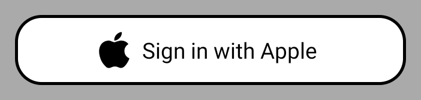
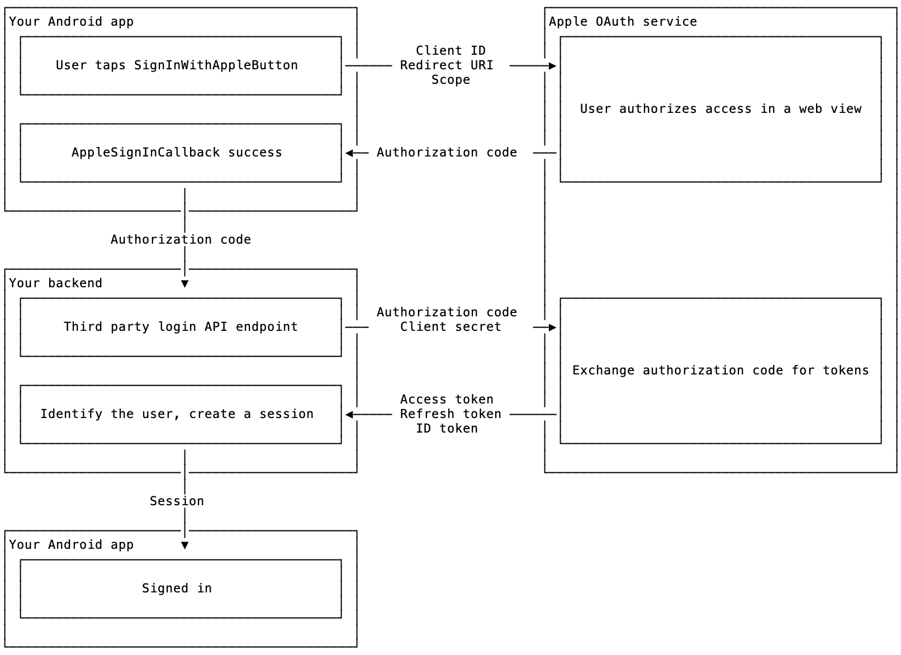

# Sign In with Apple Button for Android

A library for adding [Sign In With Apple](https://developer.apple.com/sign-in-with-apple/) to Android apps.

[](https://circleci.com/gh/willowtreeapps/sign-in-with-apple-button-android) []() []()

## How it works

This library includes a `SignInWithAppleButton` class. You can style the button according to Apple's [Human Interface Guidelines](https://developer.apple.com/design/human-interface-guidelines/sign-in-with-apple/overview/).

  

You can add this button to your login screen. When tapped, the button presents Apple's OAuth login flow in a web view. After the user signs in, your callback will receive an authorization code. You can then pass the authorization code to your backend's third party login endpoint.



## Do I need this?

You will find this library useful if both of these statements are true:

1. Your service has both an Android app and an iOS app.
2. Your apps include third-party login, like signing in with Google, Facebook, or Twitter.

In June 2019, Apple announced Sign In with Apple, another third-party login provider. They also announced that if an iOS app offers any third-party login options, [it will be an App Store requirement](https://developer.apple.com/news/?id=06032019j) to offer Sign In with Apple. This rule would go into effect "later this year" (2019). That is, if you don't add the feature, at some point you won't be able to ship updates to your iOS app.

Obviously Apple does not control Android. But if you have to add a login method to your iOS app, your users will need it on your Android app too. If it isn't supported, your users won't be able to log in if they switch to Android.

We built this library to make it as painless as possible to add Sign In with Apple to your Android app.

## Instructions

### Service setup

First, follow Apple's instructions to set up Sign In with Apple [in your iOS app](https://help.apple.com/developer-account/#/devde676e696) and [for a web service](https://help.apple.com/developer-account/#/dev1c0e25352). It is the web service setup that you'll use from Android, but you need both.

> More setup is necessary for backend operations, but the above is all you need to use this library. For more detail, you can read Aaron Parecki's walkthrough, [What the Heck is Sign In with Apple?](https://developer.okta.com/blog/2019/06/04/what-the-heck-is-sign-in-with-apple)

You should have created:

- An App ID
    - including the Sign In with Apple capability
- A Service ID
    - using the App ID as its primary
    - mapped to a domain you control
        - which Apple has verified
    - including at least one Return URL

From this setup, you will need two OAuth arguments to use this library:

- A client ID, which you entered as the Identifier field of the Service ID.
- A redirect URI, which you entered as the Return URL.

> We recommend you use an `https://` address for your redirect URI. If you use an `http://` address, you may need to include a security configuration to allow cleartext traffic. Although this library _should_ intercept the redirect request, you should regard this as a less secure option. If it's necessary, see the [Network security configuration documentation](https://developer.android.com/training/articles/security-config#CleartextTrafficPermitted) for instructions on setting up a security configuration. Add that file to your Manifest's `<application>` tag using the attribute `android:android:networkSecurityConfig`.

### Installation

Include as a dependency using Gradle:

```groovy
repositories {
    mavenCentral()
}

dependencies {
    implementation 'com.willowtreeapps:signinwithapplebutton:0.2'
}
```

Snapshot versions are also available.

```groovy
repositories {
    maven { url "https://oss.sonatype.org/content/repositories/snapshots" }
}

dependencies {
    implementation 'com.willowtreeapps:signinwithapplebutton:0.2-SNAPSHOT'
}
```

### Configuration

Add a `SignInWithAppleButton` to your login screen's layout.

Configure the button's appearance properties in layout XML:

- `sign_in_with_apple_button_colorStyle`: Specify an enum value, `"black"` (default), `"white"`, or `"whiteOutline"`.
- `sign_in_with_apple_button_textType`: Specify an enum value, `"signInWithApple"` (default) or `"continueWithApple"`.
- `sign_in_with_apple_button_cornerRadius`: Specify a dimension, like `"4dp"` (default), `"0dp"`, `"8px"`, etc.

> These options are based on the style options from Apple's [Human Interface Guidelines](https://developer.apple.com/design/human-interface-guidelines/sign-in-with-apple/overview/).

At runtime, configure the button with an instance of `SignInWithAppleService`. When creating the service object, supply these values:

- `clientId`: Use the client ID value from service setup.
- `redirectUri`: Use the redirect URI value from service setup.
- `scope`: Specify a space-delimited string of OpenID scopes, like "name email".

> According to our understanding of OpenID Connect, the "openid" scope should be included. But at this time of writing, that causes the authentication page to fail to initialize. Beta idiosyncrasies like these are documented in [How Sign in with Apple differs from OpenID Connect](https://bitbucket.org/openid/connect/src/default/How-Sign-in-with-Apple-differs-from-OpenID-Connect.md).

Also supply an implementation of `SignInWithAppleClient`. With this object, you'll provide access to a FragmentManager used to present the login interface. You'll also receive callbacks for success and failure cases.

#### Example

Set up a `SignInWithAppleButton` via XML:

```xml
<com.willowtreeapps.signinwithapplebutton.view.SignInWithAppleButton
    android:id="@+id/sign_in_with_apple_button"
    android:layout_width="wrap_content"
    android:layout_height="wrap_content"
    app:sign_in_with_apple_button_colorStyle="black"
    app:sign_in_with_apple_button_textType="signInWithApple"
    app:sign_in_with_apple_button_cornerRadius="4dp" />
```

In your Activity, create the `SignInWithAppleService`, and configure the button with it:

```kotlin
override fun onCreate(savedInstanceState: Bundle?) {
    ...

    val service = SignInWithAppleService(
        clientId = "com.your.client.id.here",
        redirectUri = "https://your-redirect-uri.com/callback",
        scope = "email"
    )

    val signInWithAppleButton = findViewById(R.id.sign_in_with_apple_button)
    signInWithAppleButton.configure(supportFragmentManager, service, client) { result ->
        when (result) {
            is SignInWithAppleResult.Success -> {
                // Handle success
            }
            is SignInWithAppleResult.Failure -> {
                // Handle failure
            }
            is SignInWithAppleResult.Cancel -> {
                // Handle user cancel
            }
        }
    }
}

### Behavior

When the user taps the button, it will present a web view configured to let the user authorize your service as an OAuth client of their Apple ID. After the user authorizes access, Apple will forward to the redirect URI and include an authorization code. The web view will intercept this request and locate the authorization code.

If the user completes authentication, your callback will receive a `SignInWithAppleResult.Success` with the authorization code. Your backend endpoint can then phone home to Apple to [exchange the authorization code for tokens](https://developer.apple.com/documentation/signinwithapplerestapi/generate_and_validate_tokens), completing login.

If instead there is a failure, your callback will receive a `SignInWithAppleResult.Failure` with the error.

If the user dismisses the authentication screen intentionally, oy will receive a `SignInWithAppleResult.Cancel`.

## Sample application

We've included a sample Android app in the `sample` folder. This app is comparable to [Apple's sample project](https://developer.apple.com/documentation/authenticationservices/adding_the_sign_in_with_apple_flow_to_your_app) for the [iOS Sign In with Apple button](https://developer.apple.com/documentation/authenticationservices/asauthorizationappleidbutton).

The sample app demonstrates:

1. Adding the button and styling it, in `activity_sample.xml`
2. Configuring the button with service details and a client, in `SampleActivity.onCreate()`
3. Making use of the authorization code on success, in the callback.

You can adjust this sample project with your service configuration and try signing in.

## Related projects

- Front end components offering a Sign In with Apple button
    - [Juice](https://developer.apple.com/documentation/authenticationservices/adding_the_sign_in_with_apple_flow_to_your_app), Apple's sample project, as seen in [WWDC 2019, Session 706 - Introducing Sign In with Apple](https://developer.apple.com/videos/play/wwdc19/706/)
    - [@react-native-community/apple-authentication](https://github.com/react-native-community/apple-authentication), a React Native library
    - [OmniAuth::Apple](https://github.com/nhosoya/omniauth-apple), an OmniAuth strategy for Rails web apps
- Backend components for Sign In with Apple
    - [apple-auth](https://github.com/ananay/apple-auth), an NPM package for JavaScript backends
    - [apple_id](https://github.com/nov/apple_id), a gem for Ruby backends

## Roadmap

- Use a Chrome Custom Tab on Marshmallow and later so users know they are not being phished
    - This will require consuming apps to configure App Links, but it's the Right Way to do it for OAuth security
- Keep up with changes to Sign In with Apple during beta; 1.0 when the service itself is 1.0
- Material-themed Sign In with Apple button?

## Contributing

Contributions are welcome. Please see the [Contributing guidelines](CONTRIBUTING.md).

This project has adopted a [code of conduct](CODE_OF_CONDUCT.md) defined by the [Contributor Covenant](http://contributor-covenant.org), the same used by the [Swift language](https://swift.org) and countless other open source software teams.

## Disclaimer

The Apple logo belongs to Apple. It's included in this library because it's specified in Apple's [Human Interface Guidelines](https://developer.apple.com/design/human-interface-guidelines/sign-in-with-apple/overview/). We're using it in good faith according to its intended purpose. As a consumer of this library, please read the HIG and avoid misusing Apple's intellectual property.

